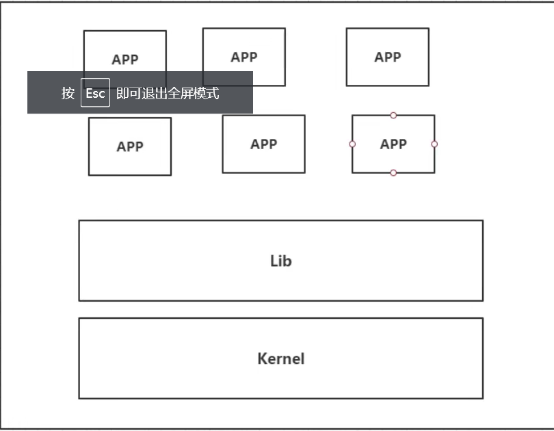
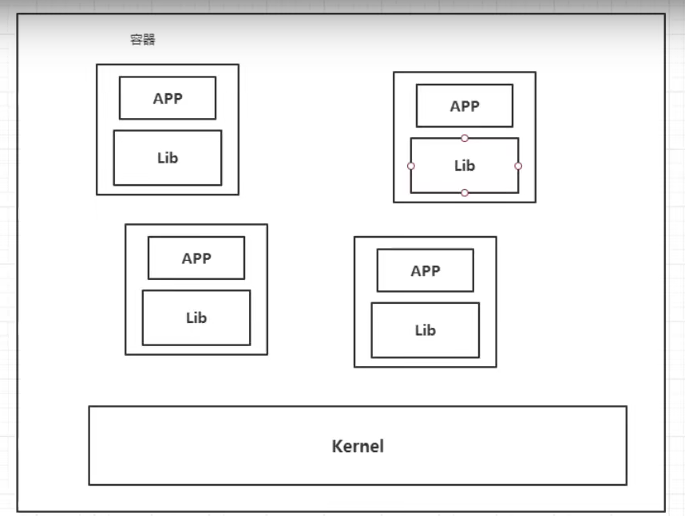

# Docker概述

## Docker为什么出现? 

有时有一些问题：

1. 在我的电脑上可以运行但是在你的电脑上运行不了。

   							   2. 版本管理和依赖上面可能有问题

所以我们想把**我们的项目和环境（Redis, Mysql, ES）一起打包上线**，这样可以解决配置麻烦和不能够跨平台的问题。

Docter给以上的问题提供了解决方案

我们将项目打包并带上环境 变成一个大jar包，然后上传到Docker仓库中，需要用的人可以直接下载我们发布的镜像然后直接运行即可

## 隔离性

通过隔离性，我们可以解决很多冲突问题，例如当两个应用有jar包或者端口号冲突，但是由于是存在在不同的容器内，所以不会导致出现问题。

而且通过隔离机制，可以将服务器利用到极致。

## 虚拟机和Docker的区别

虚拟机是下图这样，会创建一个新的kernel

而我们的docker使用的是，只需要安装一个内核就足够了，不同容器内有不同APP所需要的Lib。**相对于虚拟机来说，我们的docker省去了内核这个繁重的东西，且我们容器间是相互隔离的， 互不影响**

