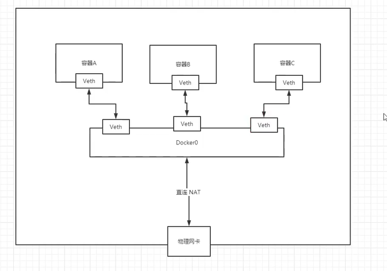

# Docker0的网络

## 1. docker的容器内部和外部之间的网络

我们创建的docker容器和docker外部，都是可以ping通的。Docker0是只要安装docker就会有个虚拟ip，docker0相当于我们所有容器的网关

> 原理

1. 我们每启动一个docker容器，docker就会给docker容器分配一个ip，我们只要安装了docker就会有一个网卡docker0，桥接模式。使用的是veth-pair方式连接的 [TODO研究一下]
2. 每有一个新的docker容器，在ifconfig里面就多一个ip地址，即多一个网卡
3. 我们的docker外部相当于一个路由器，docker容器之间的连接是通过docker0来做路由的转发



## --link

本来我们有两个docker容器，我们想要通过容器名进行ping通，可以通过--link来实现，这样我们就不用一直写ip地址了

##### 注意docker0不能通过容器名字访问

```shell
docker run -d P --name tomcat03 --link tomcat02 tomcat # tomcat03 能通过容器名 ping tomcat02但是不能反向即不能tomcat02 ping tomcat03

docker exec -it tomcat03 ping tomcat02 =>可以ping通
```

