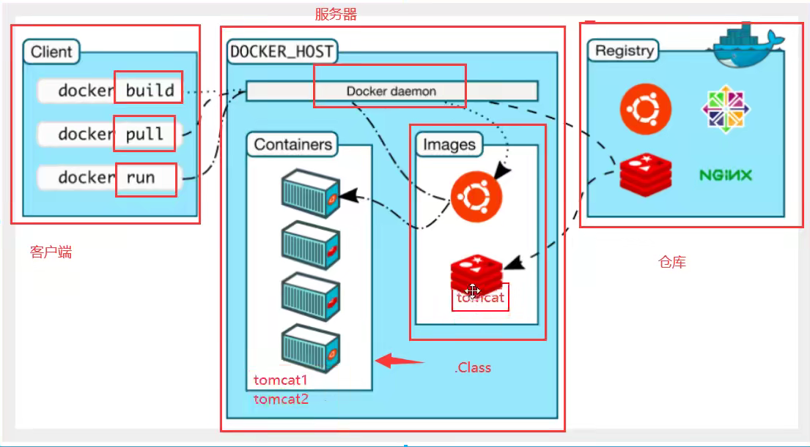

# Docker的基本组成

## 镜像

docker镜像是容器的模板，通过这个模板来创建多个容器

## 容器

Docker利用容器技术，独立运行一个或者一组应用，通过镜像来创建

## 仓库

仓库是存放镜像的地方，仓库分为公有仓库和私有仓库

## 安装

安装过程看官网https://www.docker.com/products/docker-hub

## 云服务器加速功能

使用阿里云的docker镜像加速器可以加速我们的下载