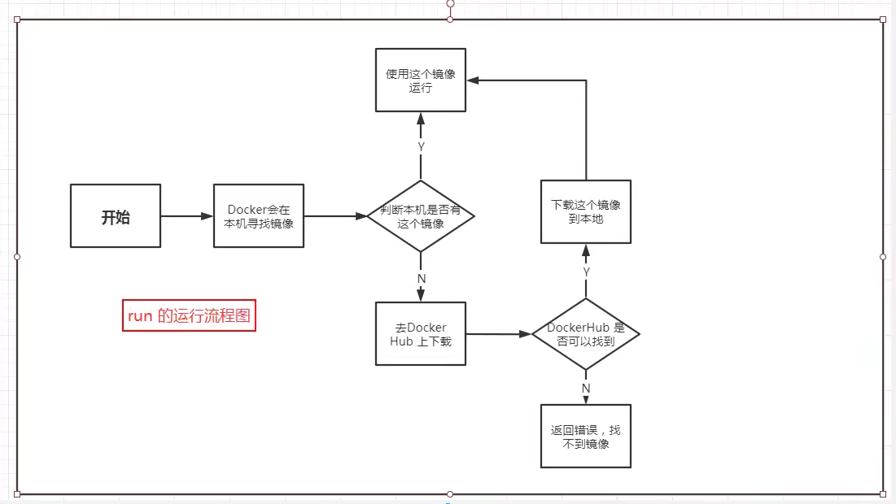
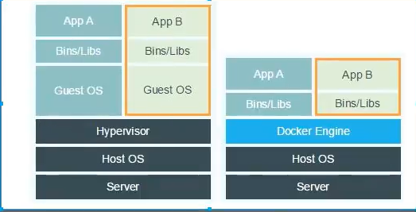

# Run流程图

## 底层原理

#### Docker是怎么工作的?

Docker是一个Client-Server结构的系统，Docker的守护进程运行在主机上，通过socket来连接客户端。就好比我们的mysql有server和client，可以存在在同一台服务器上

#### Docker为什么比虚拟机快

1. Docker有着比虚拟器更少的抽象层，例如虚拟机需要guestOS 例如ubuntu或者centos等等
   1. Docker利用的是宿主机的内核，而vm需要的是Guest OS的内核，即Docker不再需要像虚拟机一样重新加载一个操作系统内核，避免引导。